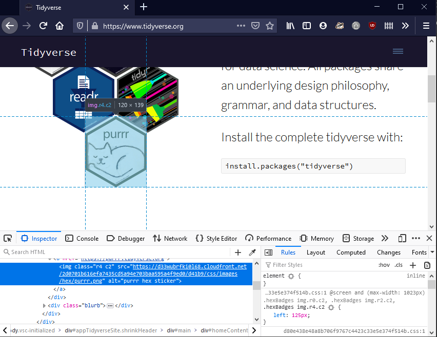

```{r setup, include=FALSE}
knitr::opts_chunk$set(echo = TRUE)
```

# Antecedentes

## Consulta Web

### Página dinámica o estática

Las páginas web estáticas son las más simples, cuando el servidor recibe un requests, envía de vuelta la response sin procesamiento adicional. Las páginas web estáticas permanecerán igual hasta que alguien las cambie.

Para las páginas web dinámicas, el contenido mostrado dependerá del visitante, además permiten *interacción* con el ususario. Esto se manifestará en formularios de búsqueda, botones y otras.

Para este tipo de páginas podemos usar la herramienta [*Selenium*](https://www.selenium.dev/) que permite automatizar la navegación web.

#### Montaje y Java
  
Revisar [Vignette](https://cran.r-project.org/web/packages/RSelenium/vignettes/basics.html) Rselenium

### Inspector (navegador web)

Permite inspeccionar los elementos web para rescatar dentro de que tag html se encuentran y que tipo de tag css se le asocia.




### Iteradores

Una vez estudiada la estrutura la pagina y como se muestra la información usaremos un ciclo repetitivo para iterar y rescatar lo que nos interesa.

Para esto usaremos acumuladores, control de flujo y pausas.

#### Acumulador
    
El enfoque utilizado es iniciarlizar una tibble (dataframe ordenada) vacia con las variables a rescatar:
```{r, warning=FALSE}
library(tibble)
resultado <-
  tibble(
    region = as.character(),
    oficina = as.character(),
    direccion  = as.character(),
    horario = as.character(),
    href = as.character(),
  )
```

Con esto, al iterar y rescatar la información relevante podemos usar la función `add_row` para actualizar la tabla

```{r}
resultado <-
  add_row(
    resultado,
    region = "nombre region rescatada",
    oficina = "nombre de la oficina",
    direccion  = "Av Clemente Perez 843",
    horario = "Lunes a Miercoles: 12:00 a 15:00",
    href = "http//vinculo.a.mapa/contiene_coordenadas",
  )
resultado
```

Asi mismo, si existen elementos que se repiten y es necesario saltar (por ejemplo comunas que son servidas por la misma oficna) podemos usar un simple vector para guardar esta informacion.

```{r}
acumulador <- c()
for (i in seq_len(21)) {
  if (i %% 3 == 1) {
    # guardamos info si se cumple condicion
    acumulador <- c(acumulador, i)
  }
}
acumulador
```

    
#### Control de flujo, romper ciclo y siguiente

Usaremos control de flujo para rescatar información, saltarnos ciertos elementos y cerrar ciclos. Esto se logra con los operadadores `if`, `else`, `next`, `break`
    
#### Pausas 

Por ultimo, sera necesario darle tiempo al navegador para cargar ciertos elementos para que pueda encontrarlos. Podemos decirle a R que espere algunos segundos con la funcion `Sys.sleep`

### Rselenium

Selenium nos permite automatizar la navegación web, para esto es necesario primero iniciar una interfaz hacia el driver del navegador

```{r, eval=FALSE}
library(RSelenium)
rD <- rsDriver(browser = "firefox", port = 4446L)
remDr <- rD[["client"]]
```

A partir de objeto `remDr` podremos interactuar con el navegador. Para navegar a una direccion podemos usar:

```{r, eval=FALSE}
remDr$navigate("https://www.google.com")
```

Una vez cargada, podemos *interrogar* al navegador buscando elementos `remDr$findElements``, seleccionandolos, haciendo click o enviando teclas a estos.

Por ejemplo, a continuación se muestra una función que empaqueta el proceso de busqueda de ciertos elementos en una página, retornandolos en una lista

```{r, eval=FALSE}
rescatar_botones <- function(remDr) {
  btns <- webElement
  sel_reg <- webElement
  sel_com <- webElement
  btns <- remDr$findElements("tag", "button")
  # for (i in seq_len(length(btns))) btns[[i]]$highlightElement()
  sel_reg <- btns[[1]]
  sel_com <- btns[[2]]
  return(list(sel_reg = sel_reg, sel_com = sel_com))
}
```

Al retornar una lista nombrada, podemos asignar el resultado a una variable y usarla para interactuar con la pagina

```{r, eval=FALSE}
el_btns <- rescatar_botones(remDr)
el_btns$sel_reg$clickElement()
```


Clases: Elementos Web

Acciones

- Visitar pagina
```{r,eval=FALSE}

```

- Rescatar elementos (clase, tag, xpath)
```{r,eval=FALSE}
opt_reg <- remDr$findElements("xpath","//*[contains(@class,'dropdown-menu open')]")[[1]]
```
- Resaltar elemento

```{r,eval=FALSE}
btns$sel_reg$highlightElement()
```
- Click
```{r,eval=FALSE}
btns$sel_reg$clickElement()
```
- Cambiar de frame: puede ser necesario para rescatar href dentro de un mapa incrustrado
```{r,eval=FALSE}
remDr$switchToFrame(iframe)
```

## Georeferenciacion

Las tablas que podamos rescatar, siempre que tengan direcciones, pueden ser sometidas a un proceso de georeferenciación.

Esto puede servir para comparar las coordenadas rescatadas de un link, o para completar elementos donde se pudo rescatar una dirección pero no una coordenada.

(Por completar)

### Rescate coordenadas

A partir de href o vinculo mapa incrustado. Es posible que la pagina que visitemos tenga algun boton asociado a mostrar un mapa, o este incrustado una vista hacia google maps. 

Si este es el caso podemos identificar el **iframe** en el que se anida el elemento y rescatar la dirección web que hace alución, la que generalmente incluye la latitud y longitud en su URL.

### Expresiones regulares

A partir de este rescate de URL con información de coordenadas podemos rescatar las coordenadas mediante expresiones regulares

```{r,warning=FALSE, message=FALSE}
# libs
# library(stringr)
# library(readr)
# library(dplyr)
# library(tidyr)

# data
data <- readr::read_csv('../data/fonasa-scrap.csv')
# ejemplo
ej <-
  data %>%
  dplyr::slice(1) # primera fila

ej$href

ej$href %>%
  stringr::str_extract('(?<=dir/).+(?=/@)') %>% # regex rescatar lat lon
  tibble::tibble(latlon = .) %>% # crear tibble
  tidyr::separate(latlon,c('lat','lon'), ',')# usar tidyr::separate
```


### Nominatim

Esta es una herramienta libre para realizar georeferenciación a partir de datos de OSM.

## Flujo General

Ejemplo de flujo:

Primero se clasifica el tipo de pagina, la informacion que tiene disponible y su estructura.

```{r, echo=FALSE}
DiagrammeR::grViz("digraph {

graph [layout = dot, rankdir = LR]

webdir [shape = folder, label = 'Directorio \nPáginas']
check_tipo_web [shape = diamond, label = 'Check \ntipo página']

estatica[shape = rect]
dinamica[shape = rect]

rselenium[shape = box]
rvest[shape = box]

check_info[shape = diamond, label = 'Check \n info disponible']
direcciones[shape = box]
mapa[shape = box, label = 'Mapa \n incrustado']
id_map_element [ shape = cds, label = 'Identificar \nelemento mapa']
href[shape = box]
iframe[shape = box]

webdir -> check_tipo_web
check_tipo_web -> {estatica dinamica}
estatica -> rvest
dinamica -> rselenium
check_tipo_web -> check_info
check_info -> {direcciones mapa}
mapa -> id_map_element
id_map_element -> {href iframe}
}")
```

Luego, para las paginas dinamicas, se interacciona usando selenium.


```{r, echo=FALSE}
DiagrammeR::grViz("digraph {

graph [layout = dot, rankdir = LR]

webdir [shape = folder, label = 'Web Dinámica']
rselenium [ shape = box]
inspect_web[shape=cds, label='Inspeccionar \nNavegador']
webelements [label = '1. Identificar \nelementos \nweb']

btn_buscar[shape = cds] 
selectores[shape = tab] 
sel_region[shape = cds] 
sel_comuna[shape = cds] 
contenedor_info[shape = tab, label = 'Contenedor\ninfo']

webelements_pack[label = '2. Empaquetar\nelementos web']
fun[shape=invhouse, label='Funcion']
list[shape=box, label = 'Lista de elementos']

iterador[label = '3. Iterar por\n los elementos']
acumulador[shape=box]
interaccion_pag[shape=box,label='interaccion\nweb']


guardar_info[label = '4. Guardar \ninformacion']
data_salida [shape = folder, label = 'Data Web']

georef[label='5. Georeferenciacion']


webdir -> rselenium
rselenium -> webelements
inspect_web -> webelements
webelements -> {btn_buscar selectores contenedor_info}
selectores -> {sel_region sel_comuna}
rselenium -> webelements_pack
webelements_pack -> {fun, list}
rselenium -> iterador
iterador -> {acumulador, interaccion_pag}
rselenium -> guardar_info
guardar_info -> data_salida

data_salida -> georef
}")
```


## Referencias

* Vignette Rselenium: [link](https://cran.r-project.org/web/packages/RSelenium/vignettes/basics.html)
